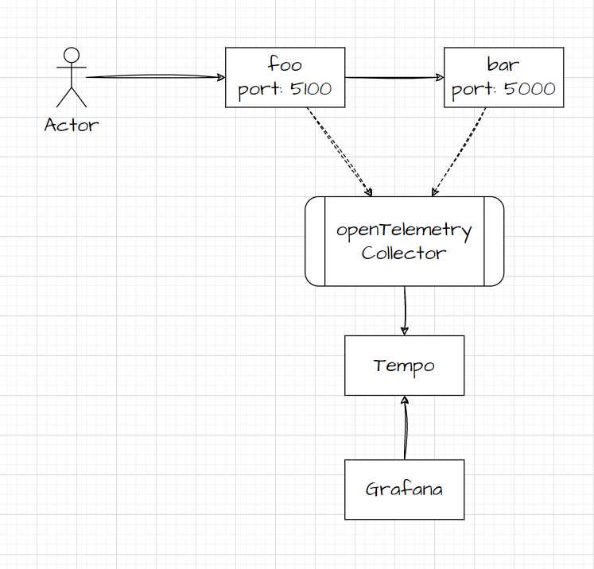
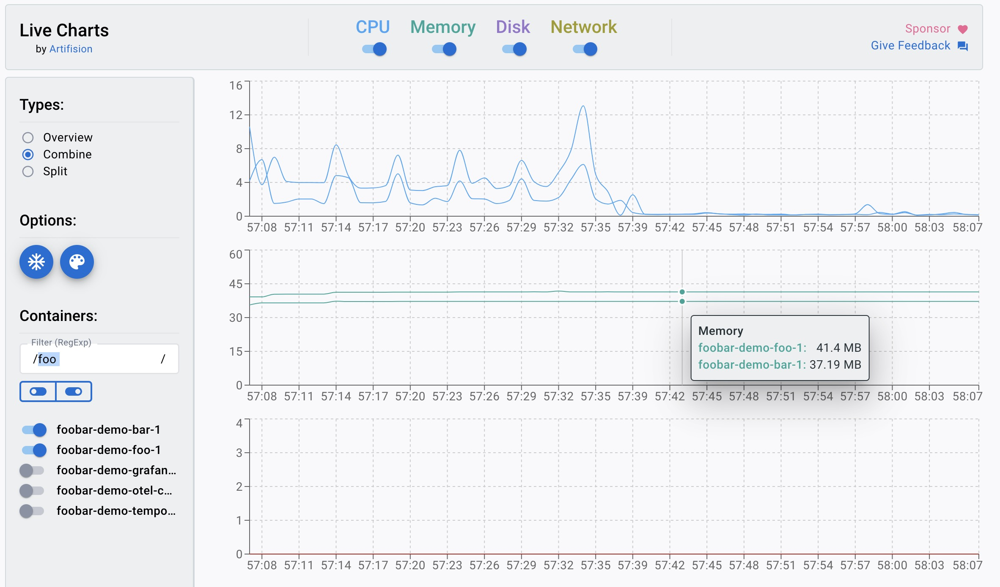

# 系统设计

该demo系统使用了以下技术栈：

- Python 3.9.17
- Flask 2.2.2
- openTelemetry 1.13.0
- docker 

在系统中，使用了分布式服务的思想，设计了两个使用Python编写的服务。

在每个服务中，引入了openTelemetry来遥测服务。同时，我们使用了OTLP exporter来搜集请求的span到OpenTelemetry Collector。

为了展示请求中每个span的耗时，我们部署了Grafana, 并通过tempo代理获取OpenTelemetry Collector搜集到的请求遥测信息。



为了测试使用openTelemetry和不使用openTelemetry对服务的影响，我们使用了grafana k6组件来创建负载。Grafana k6是一个开源负载测试工具，它以开发人员为中心并且可扩展，能够简单高效地获得性能测试结果。本项目中，相关JavaScript代码如下

```
import http from 'k6/http';
import { check, sleep } from 'k6';

export let options = {
  vus: 5,
  duration: '30s',
};

export default function () {
  let res = http.get('http://foo:5000/foo');
  check(res, {
    'is status 200': (r) => r.status === 200,
    'returns foobar': (r) => r.body == "foobar",
  });
  sleep(1);
}
```


# 测试过程

在测试前，设计了如下的测试case。

| case   | sampler       | probabilistic | use openTelemetry |
| ------ | ------------- | ------------- | ----------------- |
| case_1 | tail_sampling | 20            | YES               |
| case_2 | tail_sampling | 40            | YES               |
| case_3 | X             | X             | NO                |

首先，我们使用docker-compose工具部署整个工程，yaml文件如下：

```yaml
version: "2"
services:
  foo:
    build: ./services/foo/.
    ports:
      - "5100:5100"
    environment:
      - BAR_ENDPOINT=http://bar:5000/bar
      - AGENT_HOSTNAME=otel-collector

  bar:
    build: ./services/bar/.
    environment:
      - AGENT_HOSTNAME=otel-collector
  
  otel-collector:
    platform: linux/amd64
    image: otel/opentelemetry-collector:0.25.0
    ports:
      - "6831:6831"
      - "14268:14268"
      - "4317:4317"
    volumes:
      - ./config/otel-collector.yaml:/config/otel-collector.yaml
    command:
      - --config=/config/otel-collector.yaml

  tempo:
    image: grafana/tempo:0.7.0
    command: ["-config.file=/etc/tempo.yaml"]
    ports:
      - "3100:3100"
      - "55680:55680"
    volumes:
      - ./config/tempo.yaml:/etc/tempo.yaml
      - ./example-data/tempo:/tmp/tempo

  grafana:
    image: grafana/grafana:7.5.4
    volumes:
      - ./config/datasources:/etc/grafana/provisioning/datasources
    environment:
      - GF_AUTH_ANONYMOUS_ENABLED=true
      - GF_AUTH_ANONYMOUS_ORG_ROLE=Admin
      - GF_AUTH_DISABLE_LOGIN_FORM=true
    ports:
      - "3000:3000"
```

然后，使用grafana/k6创建负载，并输出测试结果。执行命令如下：

```shell
docker run -i --network=foobar-demo_default grafana/k6 run --quiet - <example.js
```

输出结果示例:

```
✗ is status 200
      ↳  96% — ✓ 144 / ✗ 6
     ✗ returns foobar
      ↳  96% — ✓ 144 / ✗ 6

     checks.........................: 96.00% ✓ 288      ✗ 12 
     data_received..................: 27 kB 874 B/s
     data_sent......................: 12 kB 376 B/s
     http_req_blocked...............: avg=996.26µs min=241.92µs med=610.97µs max=12.68ms p(90)=1.65ms p(95)=3.81ms  
     http_req_connecting............: avg=706.95µs min=181.36µs med=461.09µs max=12.26ms p(90)=984.94µs p(95)=1.58ms  
     http_req_duration..............: avg=18.28ms min=6.23ms med=11.83ms max=144.93ms p(90)=36.95ms p(95)=55.24ms 
       { expected_response:true }...: avg=18.61ms min=6.23ms med=12.02ms max=144.93ms p(90)=38.76ms p(95)=55.32ms 
     http_req_failed................: 4.00%  ✓ 6        ✗ 144
     http_req_receiving.............: avg=523.05µs min=61.76µs med=247.19µs max=11.62ms p(90)=855.49µs p(95)=1.45ms  
     http_req_sending...............: avg=108.64µs min=25.15µs med=78.4µs max=858.39µs p(90)=190.28µs p(95)=288.39µs
     http_req_tls_handshaking.......: avg=0s min=0s med=0s max=0s p(90)=0s p(95)=0s      
     http_req_waiting...............: avg=17.64ms min=5.91ms med=11.31ms max=144.65ms p(90)=36.23ms p(95)=52.99ms 
     http_reqs......................: 150 4.887827/s
     iteration_duration.............: avg=1.02s min=1s med=1.01s max=1.14s p(90)=1.04s p(95)=1.06s   
     iterations.....................: 150 4.887827/s
     vus............................: 5 min=5 max=5
     vus_max........................: 5 min=5 max=5
```


最后，在负载请求过程中，使用Docker Desktop Live Charts插件展示foo和bar服务的CPU、内存信息。



# 测试的结果和分析

通过执行三个不同的测试case，我们获得了如下的数据:

| case   | http_req_duration（avg） | CPU usage of Foo（avg） | Memory usage  of Foo（avg） |
| ------ | ------------------------ | ----------------------- | --------------------------- |
| case_1 | 18.28ms                  | 7                       | 40.5MB                      |
| case_2 | 16.27ms                  | 6                       | 41.4MB                      |
| case_3 | 15.43ms                  | 5                       | 25.5MB                      |

结论：

1. 使用tail_sampling时，不同的采样率，对服务请求耗时、CPU和内存使用无明显影响。
2. 服务不接入openTelemetry，请求耗时和内存占用比使用更低。
3. 服务是否接入openTelemetry，对CPU的占用无明显影响。


# 部署

代码位于目录 **foobar-demo** 中。

如需启用OpenTelemetry（工程代码中默认不启用），需要去掉下述两个文件所有注释。

```
services/foo/foo.py
services/bar/bar.py
```


服务部署步骤如下：

1. Build and run services with docker-compose:
```
docker-compose up --build -d 
```

2. See running services with:
```
docker-compose ps
```

3. Generate some load with k6:
```
docker run -i --network=foobar-demo_default grafana/k6 run --quiet - <example.js
```

4. See logs with:
```
docker-compose logs foo | grep trace_id
```

5. Pick a `trace_id` from the logs.

6. Go to Grafana (http://localhost:3000) -> Explore -> Tempo and paste the `trace_id`.

7. Stop the whole setup with:
```
docker-compose stop
```
