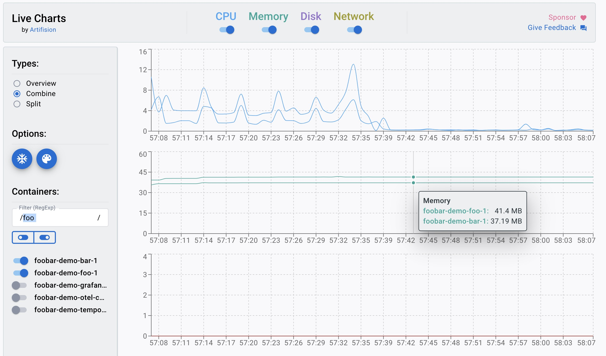

# Case_1


```
✗is status 200
↳96% — ✓144 / ✗6
✗returns foobar
↳96% — ✓144 / ✗6

checks.........................: 96.00% ✓288      ✗12 
data_received..................: 27 kB  874 B/s
data_sent......................: 12 kB  376 B/s
http_req_blocked...............: avg=996.26µs min=241.92µs med=610.97µs max=12.68ms  p(90)=1.65ms   p(95)=3.81ms  
http_req_connecting............: avg=706.95µs min=181.36µs med=461.09µs max=12.26ms  p(90)=984.94µs p(95)=1.58ms  
http_req_duration..............: avg=18.28ms  min=6.23ms   med=11.83ms  max=144.93ms p(90)=36.95ms  p(95)=55.24ms 
{ expected_response:true }...: avg=18.61ms  min=6.23ms   med=12.02ms  max=144.93ms p(90)=38.76ms  p(95)=55.32ms 
http_req_failed................: 4.00%  ✓6        ✗144
http_req_receiving.............: avg=523.05µs min=61.76µs  med=247.19µs max=11.62ms  p(90)=855.49µs p(95)=1.45ms  
http_req_sending...............: avg=108.64µs min=25.15µs  med=78.4µs   max=858.39µs p(90)=190.28µs p(95)=288.39µs
http_req_tls_handshaking.......: avg=0s       min=0s       med=0s       max=0s       p(90)=0s       p(95)=0s      
http_req_waiting...............: avg=17.64ms  min=5.91ms   med=11.31ms  max=144.65ms p(90)=36.23ms  p(95)=52.99ms 
http_reqs......................: 150    4.887827/s
iteration_duration.............: avg=1.02s    min=1s       med=1.01s    max=1.14s    p(90)=1.04s    p(95)=1.06s   
iterations.....................: 150    4.887827/s
vus............................: 5      min=5      max=5
vus_max........................: 5      min=5      max=5
```


# Case_2



```
✗is status 200
↳93% — ✓140 / ✗10
✗returns foobar
↳93% — ✓140 / ✗10

checks.........................: 93.33% ✓280      ✗20 
data_received..................: 27 kB  880 B/s
data_sent......................: 12 kB  378 B/s
http_req_blocked...............: avg=737.83µs min=162.4µs  med=570.17µs max=2.65ms   p(90)=1.45ms   p(95)=1.89ms  
http_req_connecting............: avg=531.78µs min=120.51µs med=421.51µs max=1.98ms   p(90)=924.36µs p(95)=1.24ms  
http_req_duration..............: avg=16.27ms  min=5.47ms   med=12.5ms   max=85.28ms  p(90)=24.45ms  p(95)=43.34ms 
{ expected_response:true }...: avg=16.28ms  min=5.47ms   med=12.5ms   max=85.28ms  p(90)=24.45ms  p(95)=45.39ms 
http_req_failed................: 6.66%  ✓10       ✗140
http_req_receiving.............: avg=536.78µs min=108.38µs med=248.24µs max=5.75ms   p(90)=1.11ms   p(95)=1.86ms  
http_req_sending...............: avg=90.97µs  min=16.74µs  med=67.92µs  max=559.96µs p(90)=182.28µs p(95)=239.93µs
http_req_tls_handshaking.......: avg=0s       min=0s       med=0s       max=0s       p(90)=0s       p(95)=0s      
http_req_waiting...............: avg=15.64ms  min=5.3ms    med=11.75ms  max=84.92ms  p(90)=22.69ms  p(95)=41.65ms 
http_reqs......................: 150    4.906032/s
iteration_duration.............: avg=1.01s    min=1s       med=1.01s    max=1.08s    p(90)=1.02s    p(95)=1.04s   
iterations.....................: 150    4.906032/s
vus............................: 5      min=5      max=5
vus_max........................: 5      min=5      max=5
```


# Case_3


```
 ✗is status 200
↳94% — ✓142 / ✗8
✗returns foobar
↳94% — ✓142 / ✗8

checks.........................: 94.66% ✓284      ✗16 
data_received..................: 27 kB  877 B/s
data_sent......................: 12 kB  377 B/s
http_req_blocked...............: avg=922.21µs min=173.01µs med=563.54µs max=10.46ms  p(90)=1.28ms   p(95)=2.07ms  
http_req_connecting............: avg=763.56µs min=83.07µs  med=427.55µs max=10.34ms  p(90)=1.08ms   p(95)=1.69ms  
http_req_duration..............: avg=15.43ms  min=4.77ms   med=10.12ms  max=117.66ms p(90)=25.48ms  p(95)=33.7ms  
{ expected_response:true }...: avg=15.7ms   min=4.77ms   med=10.12ms  max=117.66ms p(90)=25.69ms  p(95)=34.25ms 
http_req_failed................: 5.33%  ✓8        ✗142
http_req_receiving.............: avg=508.19µs min=83.6µs   med=277.09µs max=6.98ms   p(90)=1ms      p(95)=1.54ms  
http_req_sending...............: avg=92.73µs  min=17.42µs  med=64.86µs  max=923.48µs p(90)=181.76µs p(95)=250.98µs
http_req_tls_handshaking.......: avg=0s       min=0s       med=0s       max=0s       p(90)=0s       p(95)=0s      
http_req_waiting...............: avg=14.83ms  min=4.33ms   med=9.82ms   max=116.18ms p(90)=24.19ms  p(95)=32.83ms 
http_reqs......................: 150    4.901015/s
iteration_duration.............: avg=1.01s    min=1s       med=1.01s    max=1.12s    p(90)=1.02s    p(95)=1.06s   
iterations.....................: 150    4.901015/s
vus............................: 5      min=5      max=5
vus_max........................: 5      min=5      max=5
```

